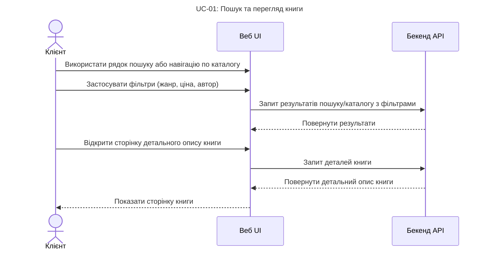
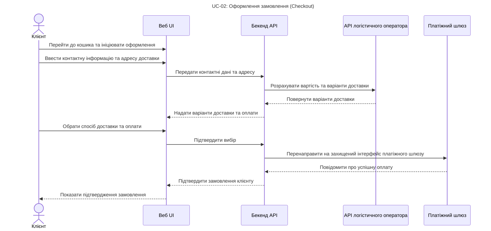
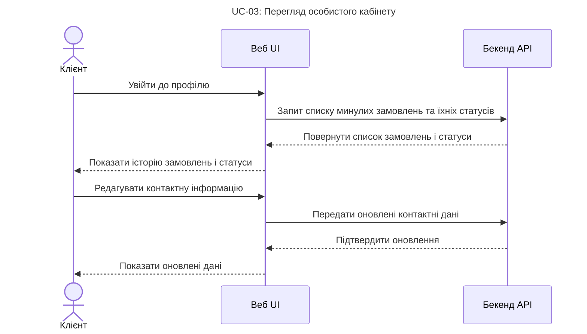
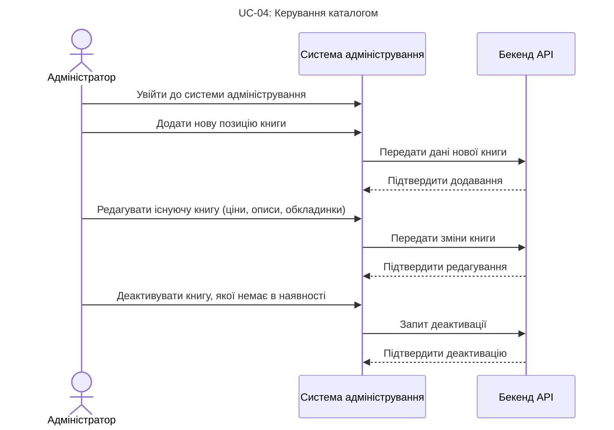
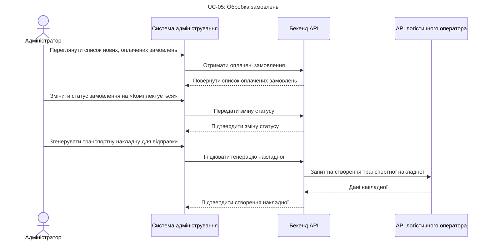

# 2. Огляд продукту

Український книжковий ринок демонструє ознаки відновлення та зростання, особливо в сегменті електронної комерції, що робить запуск цифрового сервісу перспективним.

## 2.1 Позиціонування продукту

"Плай" — це новий, самостійний онлайн-сервіс, орієнтований на український ринок. Він створюється як новий продукт, а не заміна існуючої системи, і є частиною ширшої екосистеми електронної комерції.

Продукт складається з трьох основних компонентів: клієнтський UI, бекенд-API та інтерфейс адміністрування.

Система матиме ключові залежності від зовнішніх сервісів, з якими вона інтегрується через API, але не розробляє їх з нуля (як зазначено в Розділі 1.2):

1. Платіжні шлюзи: (наприклад, LiqPay, Stripe, WayForPay) для обробки онлайн-платежів.

2. Логістичні оператори: (наприклад, Нова Пошта, Укрпошта) для розрахунку вартості, оформлення та відстеження доставки друкованих книг.

## 2.2 Функціональні вимоги до продукту

Прочитайте про функції продукту в [функціональних вимогах](https://github.com/iamvladshevchuk/singularitarians/blob/main/4_FUNCTIONAL_REQUIREMENTS.md) цього документу.

## 2.3 Обмеження продукту

* Система повинна використовувати сторонні, сертифіковані платіжні шлюзи для всіх фінансових транзакцій. Розробка власного платіжного сервісу з нуля виключена.
* Система не повинна займатися фізичною логістикою (складування, пакування, відправка). Її відповідальність обмежується генерацією замовлення та обміном даними з логістичним партнером.
* Система повинна відповідати вимогам Закону України "Про захист персональних даних" при обробці та зберіганні інформації користувачів.
* Бекенд-API повинен бути розроблений з урахуванням можливості підключення майбутніх клієнтських застосунків (наприклад, мобільних додатків).

## 2.4 Характеристики користувачів

Прочитайте про користувачів в категорії "[Персони](https://github.com/iamvladshevchuk/singularitarians/blob/main/6_PERSONAS.md)" цього документу.

## 2.5 Припущення та залежності

Припущення:

* Припускається, що користувачі мають стабільний доступ до Інтернету та використовують сучасні веб-браузери.
* Припускається, що видавці та постачальники надаватимуть метадані та файли книг у форматах, придатних для імпорту в систему.

Залежності:

* Критична залежність від стабільності та доступності API сторонніх платіжних систем. Збій у їхній роботі безпосередньо блокує основну функцію продукту (оплату).
* Критична залежність від API логістичних операторів. Збій унеможливить розрахунок вартості доставки та оформлення відправлень.
* Залежність від своєчасного оновлення каталогів від видавництв для підтримки актуальності пропозицій.

## 2.6 Розподіл вимог серед компонентів

Вимоги, описані в цьому SRS, будуть розподілені між трьома основними компонентами, визначеними в Розділі 1.2:

* Клієнтський UI (Веб): Реалізує всі функціональні вимоги, пов'язані з взаємодією кінцевого користувача (пошук, кошик, особистий кабінет, UI платіжної форми).
* Бекенд (API): Реалізує всю бізнес-логіку, керування даними, безпеку та інтеграцію з зовнішніми сервісами (платежі, логістика).
* Система адміністрування: Реалізує вимоги до керування каталогом, замовленнями та користувачами.

## 2.7 Ключові сценарії використання

Для основних [Персон](https://github.com/iamvladshevchuk/singularitarians/blob/main/6_PERSONAS.md) вказуємо такі основні сценарії використання:

### Сценарії Клієнта:

### Сценарії Адміністратора:

