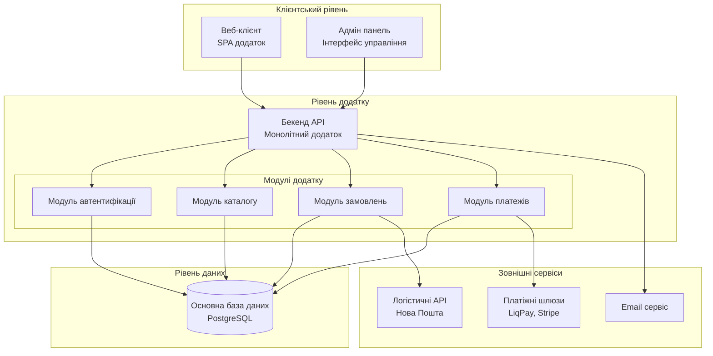
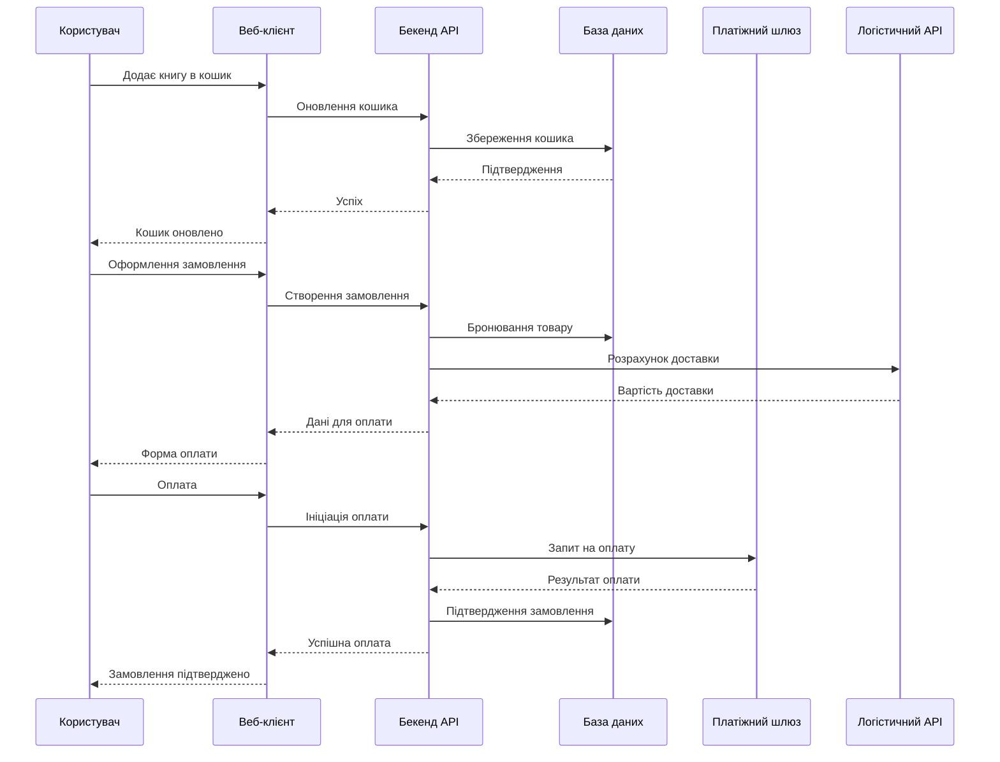

# 7. Diagram as a Code

## Високорівнева архітектура системи "Плай"

### Діаграма компонентів системи

### Діаграма потоків даних для процесу замовлення

## Опис архітектури
Система "Плай" реалізована за монолітною архітектурою з чітким розділенням модулів, що відповідає опису з пунктів 1-6 документації.

## Клієнтський рівень
- Веб-клієнт: Single Page Application для кінцевих користувачів
- Адмін панель: Інтерфейс адміністратора для управління контентом

## Рівень додатку
- Бекенд API: Єдиний монолітний додаток з модульною структурою:

    - Модуль автентифікації: управління користувачами та аутентифікація
    - Модуль каталогу: каталог книг, пошук, фільтрація
    - Модуль замовлень: кошик, замовлення, управління станом
    - Модуль платежів: обробка платежів, інтеграція з платіжними шлюзами

## Рівень даних
- Єдина база даних: PostgreSQL для всіх даних системи

## Зовнішні сервіси
- Інтеграція з платіжними системами (LiqPay, Stripe)
- Інтеграція з логістичними операторами (Нова Пошта)
- Сервіс відправки email-сповіщень

## Технологічний стек
- Frontend: Angular SPA
- Backend: ASP.NET Core монолітний API
- Database: PostgreSQL
- Кешування: Redis (опціонально)
- Хмарна інфраструктура: AWS/Azure/Google Cloud