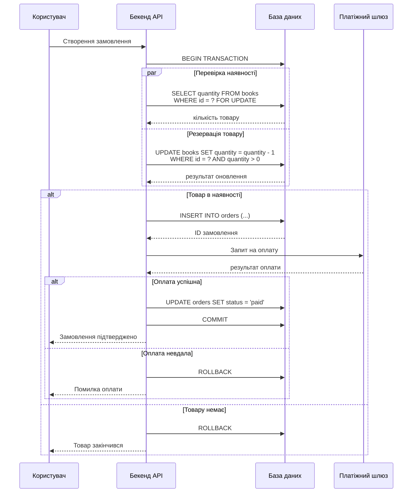
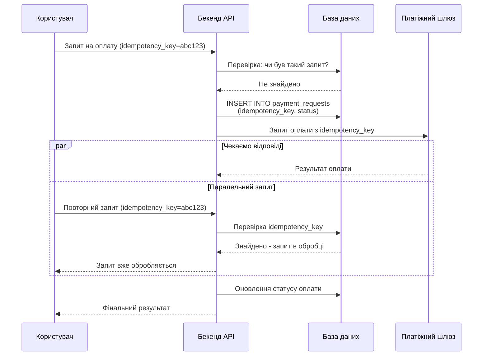
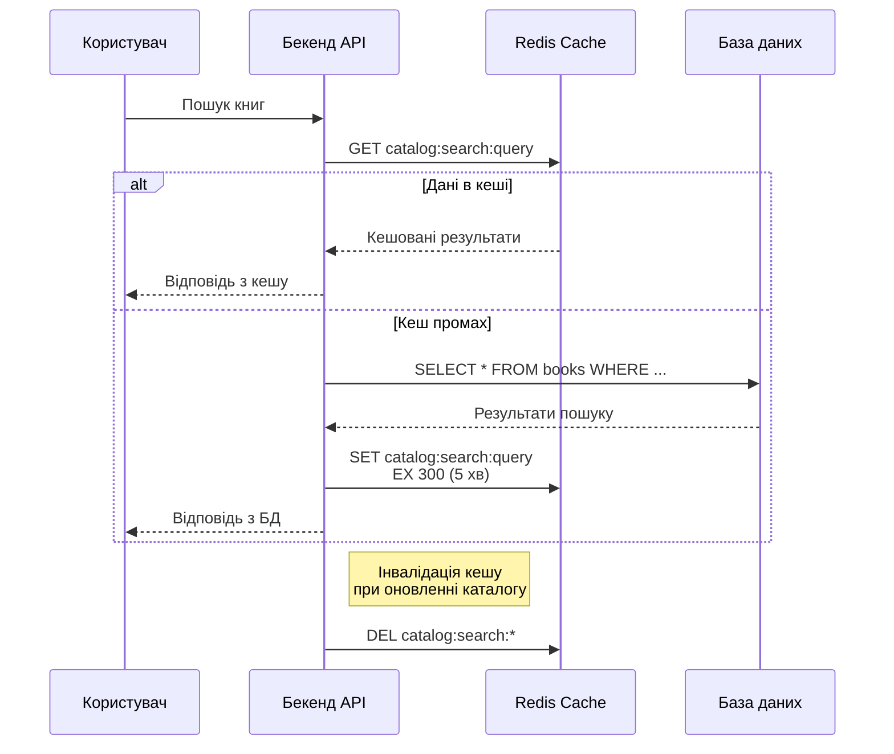
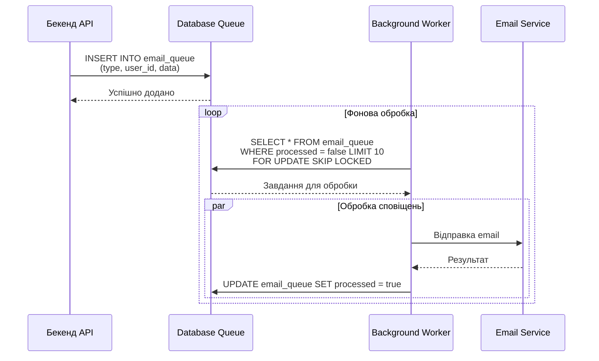
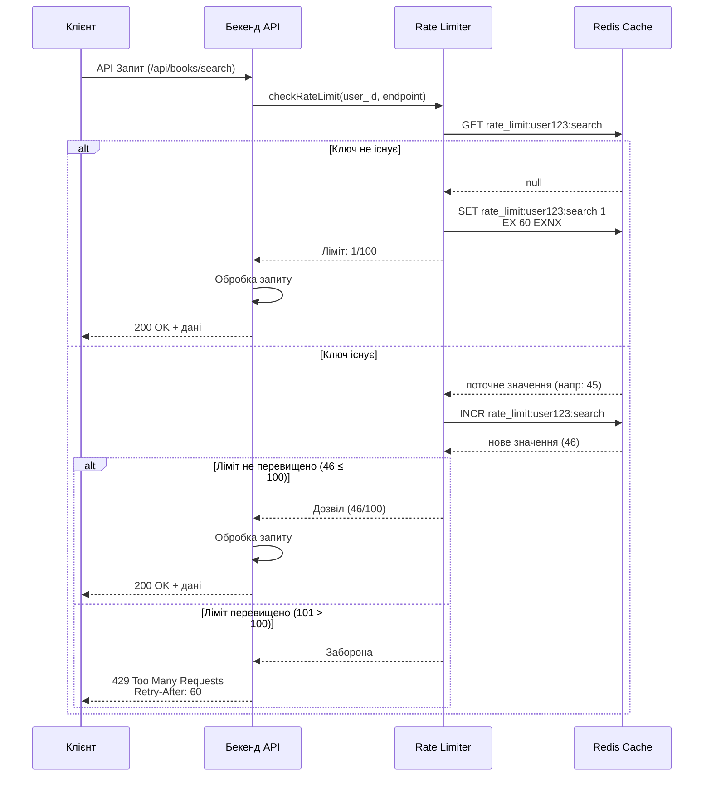
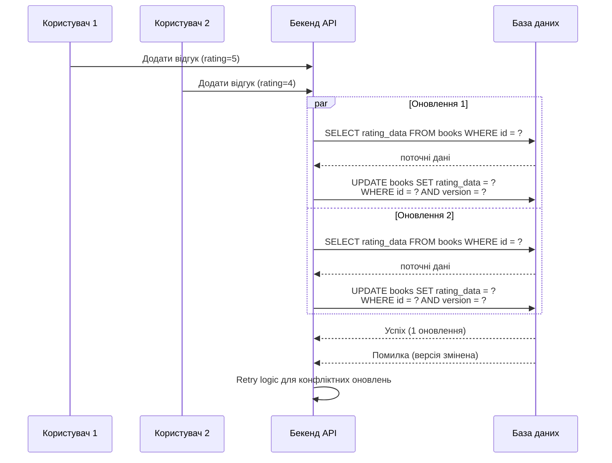

# 8. Concurrency Flows

## Вступ

У системі "Плай" використано різні патерни конкурентності для забезпечення коректної роботи при паралельних запитах. Оскільки система має монолітну архітектуру, патерни реалізовані на рівні бази даних та бекенд-логіки.

## 1. Обробка замовлень з використанням Database Transactions

Transaction Pattern з використанням FOR UPDATE та SELECT ... FOR UPDATE для блокування рядків. Забезпечує атомарність операцій резервації товару та створення замовлення.

## 2. Обробка платежів з використанням Idempotency Key

Idempotency Pattern забезпечує, що повторні виклики API з тим самим idempotency_key не призводять до повторної сплати. Критично для платіжних операцій.

## 3. Кешування каталогу з використанням Read-Through Cache

Cache-Aside Pattern з автоматичною інвалідацією кешу при змінах. Зменшує навантаження на БД при частому читанні каталогу.

## 4. Фонова обробка email-сповіщень

Background Job Pattern з використанням SKIP LOCKED для уникнення блокувань. Забезпечує асинхронну обробку без блокування основного потоку.

## 5. Обмеження запитів API (Rate Limiting) з Token Bucket

Token Bucket Algorithm реалізований через Redis. Кожен користувач має окремий лічильник для кожного endpoint. При першому запиті створюється ключ з TTL 60 секунд. Кожен наступний запит збільшує ліміт. Коли лічильник досягає максимуму (напр. 100 запитів за 60 сек), подальші запити блокуются з HTTP 429.

Переваги:

- Гнучкість: різні ліміти для різних endpoint
- Простота: легка реалізація через Redis
- Ефективність: мінімальне навантаження на API

## 6. Конкурентне оновлення рейтингів книг

Optimistic Concurrency Control з використанням версій записів. Дозволяє паралельні оновлення з автоматичним вирішенням конфліктів.

Використання цих патернів конкурентності дозволяє системі "Плай":

- Забезпечувати консистентність даних при паралельних замовленнях
- Обробляти пікові навантаження без втрати даних
- Захищати API від зловживань та перевантажень
- Покращувати продуктивність через кешування та фонова обробку
- Забезпечувати ідемпотентність критичних операцій